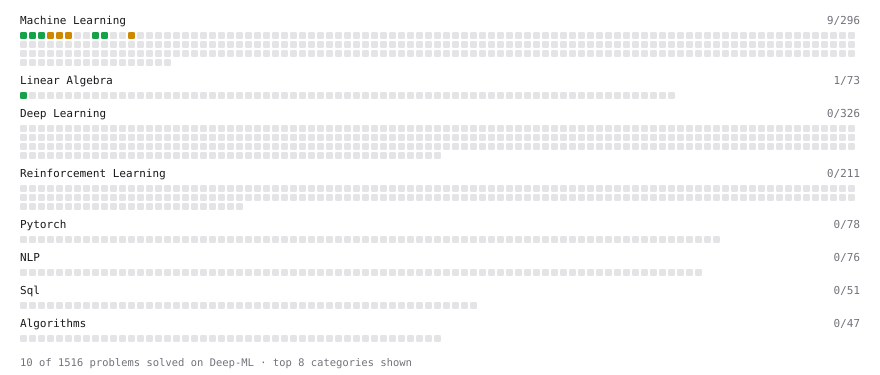

# Deep-ML

My machine learning practice from [Deep-ML](https://www.deep-ml.com). Every solution here was written by hand.

**7** solved · 7 problems · 0 labs · 0 math

[**Browse the interactive portfolio**](https://xquantize.github.io/deep-ml/) to replay this filling in over time.

## Problems

| | Difficulty | Solved | |
| --- | --- | --- | --- |
| [Batch Iterator for Dataset](https://www.deep-ml.com/problems/30) | easy | 2026-10-08 | [solution](problems/0030-batch-iterator-for-dataset) |
| [Feature Scaling Implementation](https://www.deep-ml.com/problems/16) | easy | 2026-10-11 | [solution](problems/0016-feature-scaling-implementation) |
| [Linear Regression Using Gradient Descent](https://www.deep-ml.com/problems/15) | easy | 2026-10-06 | [solution](problems/0015-linear-regression-using-gradient-descent) |
| [Linear Regression Using Normal Equation](https://www.deep-ml.com/problems/14) | easy | 2026-10-06 | [solution](problems/0014-linear-regression-using-normal-equation) |
| [Matrix-Vector Dot Product](https://www.deep-ml.com/problems/1) | easy | 2026-10-05 | [solution](problems/0001-matrix-vector-dot-product) |
| [Random Shuffle of Dataset](https://www.deep-ml.com/problems/29) | easy | 2026-10-06 | [solution](problems/0029-random-shuffle-of-dataset) |
| [K-Means Clustering](https://www.deep-ml.com/problems/17) | medium | 2026-10-08 | [solution](problems/0017-k-means-clustering) |

---

_This file is regenerated by Deep-ML on every push._
